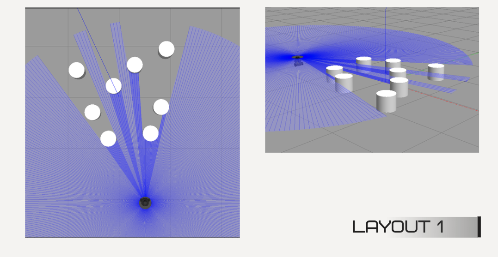
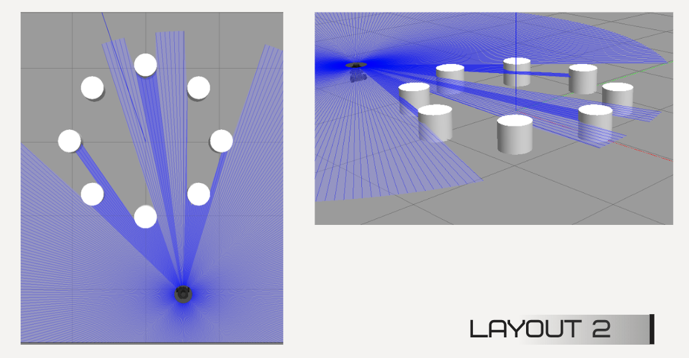
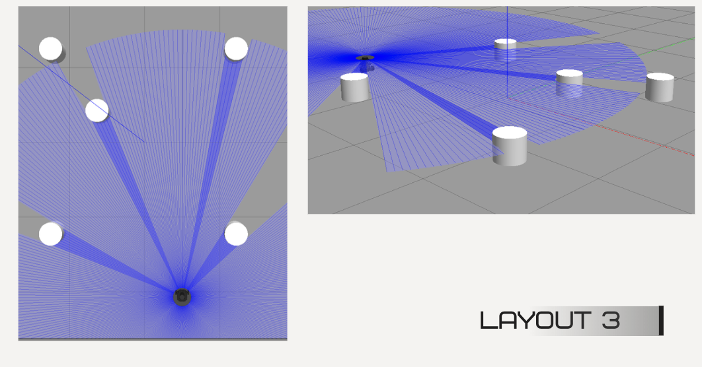
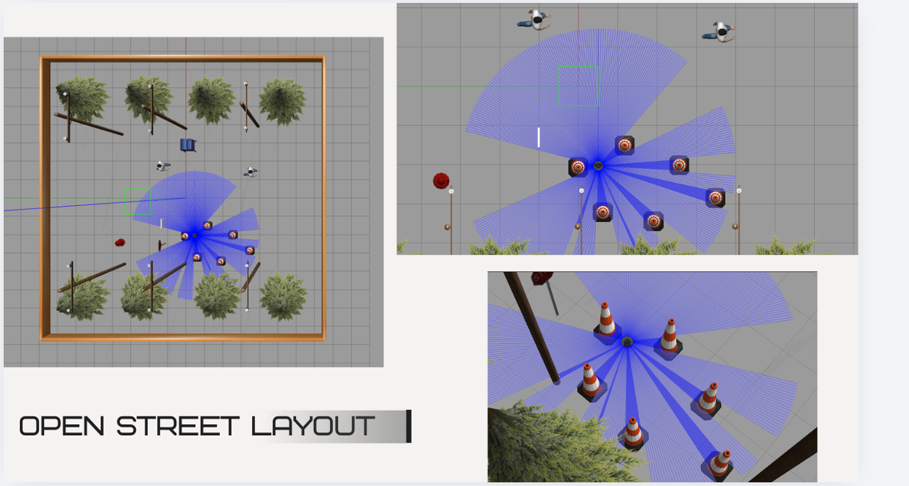
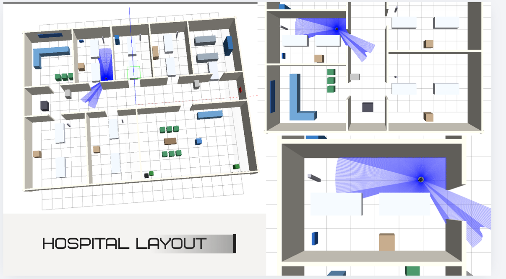

# Saaho — TurtleBot3 goal navigation with deep RL (TD3)

ROS 2 **Humble**, **Gazebo**, and a **Twin Delayed DDPG (TD3)** policy drive a **TurtleBot3 Burger** toward user goals using **2D LiDAR** and **goal-relative state**—without a global map in the policy.

---

## What we built

| Area | Description |
|------|-------------|
| **Simulation** | Custom Gazebo worlds: training layouts (0–3), **open street** (minimal `openstreet.world` canvas + your props), **hospital**. |
| **Learning** | Off-policy continuous control: **TD3** actor–critic, 26-D state (24 LiDAR samples + distance + heading to goal), 2-D velocity action. |
| **Training** | **Phase 1:** TD3 on **layout 0 only**, **1000 episodes**. **Phase 2:** same algorithm on **four** distinct obstacle layouts with **random goals**, **1000 episodes**, **~12 hours** (GPU). |
| **Evaluation** | After diverse training, the policy was **tested qualitatively** on **hospital** and **open street**—worlds not identical to the training grid layouts. |
| **Deployment** | `demo_continuous.py` loads **`model_td3_diverse.pt`** and follows goals from RViz (`/goal`, `/move_base_simple/goal`, etc.). |
| **Baseline** | Discrete **DQN** path (`train.py`, `agent.py`) for comparison; TD3 is primary for smooth continuous motion. |

---

## Training timeline (how we did it)

1. **First training — layout 0 only**  
   Single static world **`turtlebot3_layout0.world`**, **1000 episodes**, fixed curriculum on that geometry. This established a working TD3 stack and a baseline policy tuned to one arena.

2. **Second training — four layouts**  
   **Diverse** training (`train_td3_diverse.py`): cycle through **`turtlebot3_layout0.world` … `turtlebot3_layout3.world`**, **random goal** \((x,y)\) each episode (with a simple “avoid the very center” rule so goals stay reachable). **1000 episodes** total across the four worlds (**~250 episodes per layout**), **~12 hours** on GPU. The same network weights continue from phase 1 so the agent **unlearns overfitting** to layout 0 alone and learns clutter patterns that transfer better.

3. **Testing after training**  
   The **final diverse checkpoint** was exercised in simulation on:
   - **`hospital_world.world`** — multi-room interior (hard for map-free TD3; mainly qualitative / stress test).
   - **`openstreet.world`** — minimal **30×30** fenced plane + sun; add obstacles in Gazebo **Insert** for custom scenes (replaces the old heavy saved world and separate `open_world` arena).

   These are **out-of-distribution** relative to the tight training layouts; they show how far the LiDAR + goal policy generalizes without a map.

---

## How it works (short)

1. **`env.py`** subscribes to **`/scan`** and **`/odom`**, builds a normalized state (LiDAR downsampled to **24** beams, capped ~**3.5 m**, plus goal distance / heading in **odom**).
2. **`agent_td3.py`** maps state → **linear** and **angular** velocity; experience replay + twin critics + delayed policy updates.
3. Rewards encourage reaching the goal and penalize collisions and tight clearance (`env.py`).
4. **Diverse training** swaps world files and resamples goals each episode so the policy does not memorize one map and one target.

---

## Gazebo layouts (figures)

All screenshots are in **`images/`** (no spaces in filenames).

### Layout 0 — `turtlebot3_layout0.world`

Hexagonal-style arena with a **3×3 grid of targets** and LiDAR (blue rays); **phase-1** training used **only** this layout (1000 episodes).


### Layout 1 — `turtlebot3_layout1.world`

**Eight** white **cylinders** in a loose **V / triangular** pattern; **360°** LiDAR, top-down and perspective.



### Layout 2 — `turtlebot3_layout2.world`

**Eight** cylinders in a **ring**; symmetric clutter and encircled free space.



### Layout 3 — `turtlebot3_layout3.world`

**Five** cylinders **spread** across the grid (corners / sides); sparser obstacles.



### Open street — `openstreet.world`

Minimal **30×30** ground, boundary walls, and **model://sun**. Use Gazebo’s **Insert** tab to add models; save a new `.world` if you want a fixed layout. **`open_street.world`** in the repo is the same minimal template under another name.



### Hospital — `hospital_world.world`

Multi-room floor plan (beds, desks, partitions); **post-training** test. Long **room-to-room** behavior usually needs **Nav2 / a map**, not map-free TD3 alone.



---

## Training results (phase 2 — four layouts)

Numbers below come from **`trained_models/DIVERSE_TRAINING_RESULTS.md`** for the **1000-episode four-layout** run (aligned with phase 2; wall time in that log was ~8 h—use **~12 h** if that matches your machine).

| Metric | Value |
|--------|--------|
| Algorithm | **TD3** |
| Phase 2 episodes | **1000** (≈250 per layout × 4) |
| Random goals | \(x, y \in [-2.5, 2.5]\), avoiding a central obstacle band |
| **Overall success** (goal reached) | **32.7%** (327 / 1000) |
| Best single-layout success | ~**43–44%** on two layouts |
| Phase 1 (layout 0 only, 1000 ep) | Baseline before diversity; strong on that geometry, weaker on random goals until phase 2 |

**Saved artifact:** `trained_models/model_td3_diverse.pt` (plus logs/checkpoints in `trained_models/`).

**Takeaway:** Phase 2 **reduces** memorization of layout 0 and **improves** behavior when both **layout** and **goal** change; hospital / open street testing shows **limits** of a map-free policy on large structured maps.

---

## Why TD3 (and not DQN only)

- Control is **continuous** (velocities). **TD3** outputs real-valued actions; **DQN** here uses a **small discrete** action set → coarser steering.
- **TD3** (clipped double Q, delayed policy, target smoothing) is a standard choice for continuous control with replay.

---

## Quick start (Docker + hospital demo)

Prerequisites: **`ros2_container`** from **`DockerFile`**, X11 (`xhost +local:docker`), **`DISPLAY`** set.

```bash
./scripts/start_hospital_stack.sh
```

**Stock TurtleBot3 house world:**

```bash
docker exec -e DISPLAY=$DISPLAY -e TURTLEBOT3_MODEL=burger -d ros2_container bash -lc \
  'source /opt/ros/humble/setup.bash && ros2 launch turtlebot3_gazebo turtlebot3_world.launch.py'
```

**Custom layouts** — copy **`worlds/*.world`** and **`launch/turtlebot3_*.launch.py`** into the container, then e.g. `ros2 launch /root/turtlebot3_layout1.launch.py`.

**Training (container):**

```bash
cd /workspace/drone_rl
source /opt/ros/humble/setup.bash
python3 train_td3.py              # phase-1 style: one world, fixed goal (when Gazebo is that world)
python3 train_td3_diverse.py      # phase 2: four layouts + random goals
```

---

## Repository map (high level)

| Path | Role |
|------|------|
| `worlds/` | `turtlebot3_layout0–3`, `openstreet`, `open_street`, `hospital_world` |
| `launch/` | `turtlebot3_hospital.launch.py`, layout / open_street launches |
| `drone_rl/env.py` | ROS environment + reward |
| `drone_rl/agent_td3.py` | TD3 |
| `drone_rl/train_td3.py` | Single-world training |
| `drone_rl/train_td3_diverse.py` | Four layouts + random goals |
| `drone_rl/demo_continuous.py` | Live demo + RViz goals |
| `trained_models/` | Weights + `DIVERSE_TRAINING_RESULTS.md` |
| `images/` | `layout0.png` … `layout3.png`, `open_street.png`, `hospital.png` |

---

## Limitations

- **Map-free** policy: weak on long **room-to-room** hospital tasks without Nav2 / mapping.
- **24** LiDAR bins, **~3.5 m** clamp — compressed geometry.
- **32.7%** on the mixed 1000-ep curriculum is progress, not solved navigation.

---

## Credits

Project **Saaho** — simulation, two-phase TD3 training, diverse layouts, and evaluation on **hospital**, **main open arena**, and **open street**.
