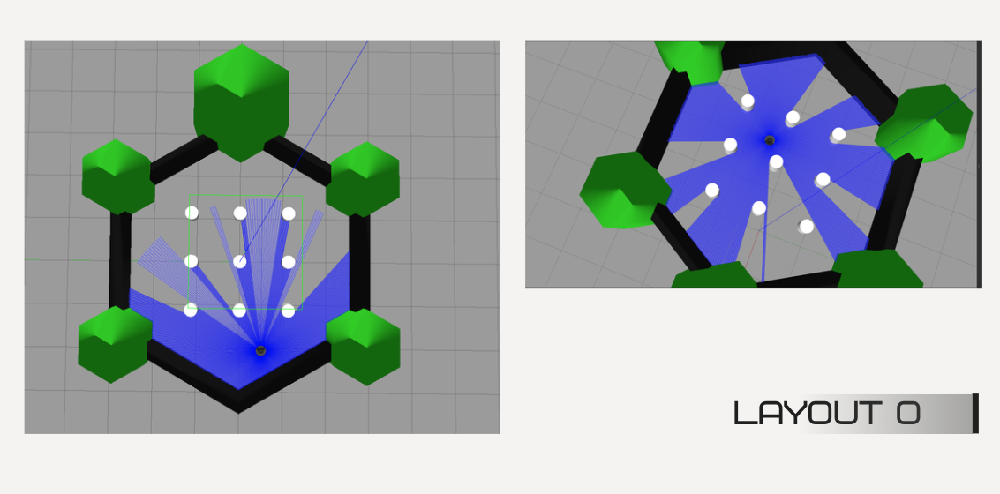

# Saaho — TurtleBot3 goal navigation with deep RL (TD3)

ROS 2 **Humble**, **Gazebo**, and a **Twin Delayed DDPG (TD3)** policy drive a **TurtleBot3 Burger** toward user goals using **2D LiDAR** and **goal-relative state**—without a global map in the policy.

---

## What we built

| Area | Description |
|------|-------------|
| **Simulation** | Custom Gazebo worlds: training layouts (0–3), open arena / street scene, multi-room hospital. |
| **Learning** | Off-policy continuous control: **TD3** actor–critic, 26-D state (24 LiDAR samples + distance + heading to goal), 2-D velocity action. |
| **Training** | Single-layout TD3 (`train_td3.py`), then **diverse** training across **four** obstacle worlds with **random goals** (`train_td3_diverse.py`). |
| **Deployment** | `demo_continuous.py` loads **`model_td3_diverse.pt`** and follows goals from RViz (`/goal`, `/move_base_simple/goal`, etc.). |
| **Baseline** | Discrete **DQN** path (`train.py`, `agent.py`) for comparison; TD3 is primary for smooth continuous motion. |

---

## How it works (short)

1. **`env.py`** subscribes to **`/scan`** and **`/odom`**, builds a normalized state (LiDAR downsampled to **24** beams, capped ~**3.5 m**, plus goal distance / heading in **odom**).
2. **`agent_td3.py`** maps state → **linear** and **angular** velocity; experience replay + twin critics + delayed policy updates.
3. Rewards encourage reaching the goal and penalize collisions and tight clearance (`env.py`).
4. **Diverse training** swaps **`turtlebot3_layout0.world` … `layout3.world`** and resamples a random goal each episode so the policy does not memorize one map and one target.

---

## Gazebo layouts (with figures)

Screenshots live in **`images/`**. Filenames contain spaces; links below use URL encoding so they render on GitHub.

### Layout 0 — `turtlebot3_layout0.world`

Hexagonal arena with a **3×3 grid of targets** and a LiDAR-equipped agent (perimeter vs center views). Used as one of four training geometries in the diverse curriculum.



### Layout 1 — `turtlebot3_layout1.world`

**Eight** white **cylinders** in a loose **V / triangular** pattern; TurtleBot with **360°** LiDAR (blue rays), top-down and perspective. Strong diversity signal for obstacle shadows and gaps.


### Layout 2 — `turtlebot3_layout2.world`

**Eight** cylinders in a **ring**; same LiDAR visualization. Stresses symmetric clutter and encircled free space.


### Layout 3 — `turtlebot3_layout3.world`

**Five** cylinders **spread** across the grid (corners / sides). Fewer obstacles but more open variation; tests generalization to sparse layouts.


### Open street — `open_street.world` / open arena

Larger **street-style** scene: walls, trees, cones, props; LiDAR interacting with varied meshes. Suitable for free-form goals and editing in SDF.


### Hospital — `hospital_world.world`

**Multi-room** interior: beds, desks, partitions. Map-free TD3 is **weak** here for long room-to-room tasks; this world is better paired with **Nav2 / mapping** or hierarchical planning. Still useful for sensing visualization and future hybrid work.


---

## Training results (diverse TD3)

Summarized from **`trained_models/DIVERSE_TRAINING_RESULTS.md`** (run completed **April 4, 2026**):

| Metric | Value |
|--------|--------|
| Algorithm | **TD3** |
| Total episodes | **1000** (250 per layout × 4 layout files) |
| Approx. duration | ~**8 hours** (GPU) |
| Random goals | \(x, y \in [-2.5, 2.5]\), avoiding a central obstacle band |
| **Overall success** (goal reached) | **32.7%** (327 / 1000) |
| Best single-layout success | ~**43–44%** on two layouts |
| vs single-layout + fixed goal | Much higher on that one point; **poor** on random goals without diverse training |

**Saved artifact:** `trained_models/model_td3_diverse.pt` (and episodic checkpoints / logs in the same folder).

**Takeaway:** Diverse layouts + random goals **hurt** peak performance on a memorized target but **improve** robustness when the scene and goal change—consistent with the report’s ~**3×** improvement on random-goal evaluation vs the earlier single-layout model.

---

## Why TD3 (and not DQN only)

- TurtleBot control is **continuous** (velocities). **TD3** outputs real-valued actions; **DQN** in this repo uses a **small discrete** action set, which is coarser for steering.
- **TD3** (clipped double Q, delayed policy, target smoothing) is a standard stable choice for **continuous** robot benchmarks with replay buffers.

---

## Quick start (Docker + hospital demo)

Prerequisites: **`ros2_container`** built from this repo’s **`DockerFile`**, X11 (`xhost +local:docker`), **`DISPLAY`** set.

```bash
# Hospital world + RViz + nav goal bridge + TD3 demo (see script for details)
./scripts/start_hospital_stack.sh
```

**Default TurtleBot3 house world** (stock package):

```bash
docker exec -e DISPLAY=$DISPLAY -e TURTLEBOT3_MODEL=burger -d ros2_container bash -lc \
  'source /opt/ros/humble/setup.bash && ros2 launch turtlebot3_gazebo turtlebot3_world.launch.py'
```

**Custom layouts** — copy **`worlds/*.world`** and the matching **`launch/turtlebot3_<name>.launch.py`** into the container, then:

```bash
ros2 launch /root/turtlebot3_layout1.launch.py   # example
```

(Exact paths depend on where you `docker cp` the launch file.)

**Training inside the container** (with Gazebo up or as scripted in `train_td3_diverse.py`):

```bash
cd /workspace/drone_rl
source /opt/ros/humble/setup.bash
python3 train_td3_diverse.py
```

---

## Repository map (high level)

| Path | Role |
|------|------|
| `worlds/` | SDF worlds: `turtlebot3_layout0–3`, `open_world`, `open_street`, `hospital_world` |
| `launch/` | `turtlebot3_hospital.launch.py`, per-layout / open_street launch files |
| `drone_rl/env.py` | ROS environment + reward |
| `drone_rl/agent_td3.py` | TD3 networks + training step |
| `drone_rl/train_td3.py` | Single-world training |
| `drone_rl/train_td3_diverse.py` | Multi-layout + random goals |
| `drone_rl/demo_continuous.py` | Live demo with RViz goals |
| `trained_models/` | Weights + `DIVERSE_TRAINING_RESULTS.md` |
| `images/` | Figures for this README |

---

## Limitations (honest)

- Policy is **map-free**: no occupancy grid or topology—**room-to-room** hospital navigation is not the strong suit of the raw TD3 demo.
- State uses **24** LiDAR bins and ~**3.5 m** clamping—fine detail and distant structure are compressed.
- Reported **32.7%** success on the hard mixed curriculum is real progress but **not** “solved navigation.”

---

## Credits

Course / team project **Saaho**; implementation spans simulation, TD3 training, diverse curricula, and hospital / street world assets. Figures in **`images/`** document layouts and LiDAR behavior in Gazebo.
